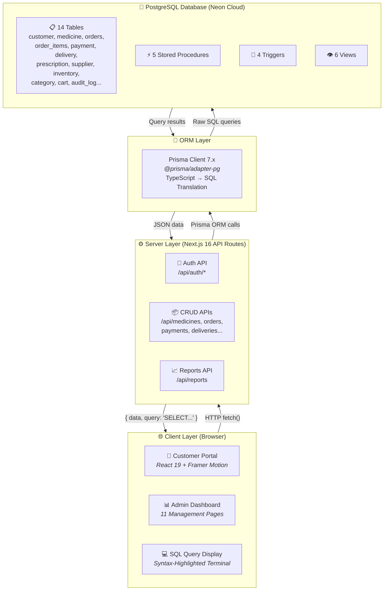
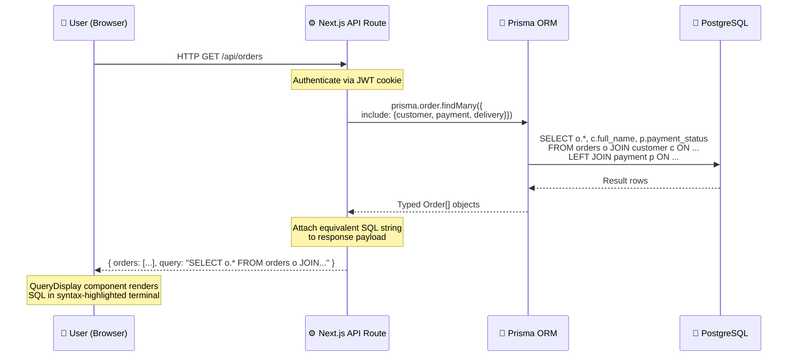
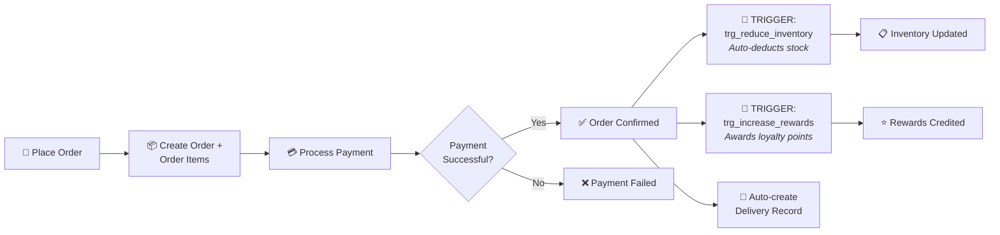

# 💊 Healix — Next-Gen Online Pharmacy Platform

<p align="center">
  
  
  
  
  
  
  
  
  
  
  
</p>

> A full-stack pharmacy management system built for the **DBMS (Database Management Systems)** course, demonstrating real-world relational database design with **PostgreSQL**, advanced SQL constructs (Stored Procedures, Triggers, Views), and a live ORM-to-SQL mapping layer visible directly on the frontend.

---

## 📑 Table of Contents

- [Project Overview](#-project-overview)
- [Technology Stack](#-technology-stack)
- [System Architecture](#-system-architecture)
- [Database Design](#-database-design)
  - [ER Diagram Entities](#1-er-diagram-entities)
  - [Relationships](#2-relationships)
  - [Relational Schema Mapping](#3-relational-schema-mapping)
- [Advanced SQL Constructs](#-advanced-sql-constructs)
  - [Stored Procedures](#1-stored-procedures-5)
  - [Triggers](#2-triggers-4)
  - [Views](#3-views-6)
- [ORM-to-SQL Mapping — How It Works](#-orm-to-sql-mapping--how-it-works)
- [Important SQL Queries](#-important-sql-queries)
- [Project Structure](#-project-structure)
- [Setup & Installation](#-setup--installation)

---

## 🏥 Project Overview

**Healix** is a production-grade online pharmacy platform that covers the complete lifecycle of pharmaceutical e-commerce:

- **Customer Portal** — Browse medicines, add to cart, place orders, upload prescriptions, earn reward points
- **AI Pharmacist Widget** — Interactive chatbot for medication guidance (rule-based demo)
- **Prescription Verification** — Upload doctor slips with simulated AI-OCR extraction pipeline
- **Admin Dashboard** — Full CRUD management for customers, medicines, inventory, orders, payments, deliveries, suppliers, prescriptions, reports, and audit logs
- **Live SQL Display** — Every API response includes the equivalent raw SQL query, rendered in a syntax-highlighted terminal on the frontend

**Key DBMS concepts demonstrated:**
- ER-to-Relational Schema mapping
- Normalization (3NF)
- Stored Procedures with business logic
- Database Triggers for automatic side-effects
- Views for complex reporting
- Composite & multivalued attributes
- Generalization/Specialization (ISA hierarchy)
- Referential integrity with cascading operations

---

## 🛠 Technology Stack

| Layer | Technology | Badge | Purpose |
|-------|-----------|-------|---------|
| **Database** | PostgreSQL 16 |  | Primary RDBMS hosted on Neon Cloud |
| **ORM** | Prisma 7.x |  | Type-safe database access via `@prisma/adapter-pg` |
| **Backend** | Next.js 16 |  | API Routes (RESTful endpoints) + SSR |
| **Frontend** | React 19 |  | Component-based UI with App Router |
| **Styling** | Tailwind CSS 4 |  | Utility-first responsive design |
| **Animations** | Framer Motion |  | Page transitions & micro-animations |
| **Charts** | Recharts 3 |  | Data visualization in reports |
| **Auth** | JWT + bcryptjs |  | Stateless auth with hashed passwords |
| **Language** | TypeScript 5 |  | End-to-end type safety |
| **Hosting** | Neon Cloud |  | Serverless PostgreSQL |

---

## 🏗 System Architecture

### High-Level Architecture Diagram



### Request-Response Workflow



### Order Placement Flow (Triggers & Stored Procedures in Action)



### Data Flow

1. **User interacts** with the React frontend (browse medicines, place order, etc.)
2. **Frontend sends** HTTP requests to Next.js API routes
3. **API route** uses **Prisma ORM** to execute type-safe database operations
4. **Prisma translates** the ORM call into a raw PostgreSQL query and executes it via the `pg` adapter
5. **API returns** the data **plus** a hand-crafted SQL query string showing the equivalent raw SQL
6. **Frontend renders** the data, and displays the SQL query in a collapsible syntax-highlighted terminal widget (`QueryDisplay` component)

---

## 🗄 Database Design

### 1. ER Diagram Entities

The database models **14 tables** mapped from the ER diagram:

#### Core Entities

| Entity | Primary Key | Description |
|--------|------------|-------------|
| **Customer** | `customer_id` | Registered users with ISA specialization (Regular/Premium) |
| **Medicine** | `medicine_id` | Pharmaceutical products with strength, pricing, expiry |
| **Order** | `order_id` | Purchase orders linking customers to medicines |
| **OrderItem** | `order_item_id` | Weak entity — individual line items within an order |
| **Payment** | `payment_id` | Payment records per order (Online, UPI, Card, COD) |
| **Delivery** | `delivery_id` | Shipment tracking per order |
| **Prescription** | `prescription_id` | Doctor prescriptions with verification status |
| **Supplier** | `supplier_id` | Pharmaceutical suppliers/distributors |

#### Supporting Entities

| Entity | Primary Key | Description |
|--------|------------|-------------|
| **Admin** | `admin_id` | Administrative users (separate table for role separation) |
| **Category** | `category_id` | Medicine categories (Pain Relief, Antibiotics, etc.) |
| **Inventory** | `inventory_id` | Stock tracking with reorder levels and alerts |
| **SupplierMedicine** | `supplier_medicine_id` | Junction table for M:N Supplier↔Medicine relationship |
| **RewardTransaction** | `reward_id` | Reward points earning/spending history |
| **AuditLog** | `log_id` | System-wide action audit trail |
| **Cart / CartItem** | `cart_id` / `cart_item_id` | Shopping cart for active sessions |

#### Customer Entity — Detailed Attributes

The Customer entity demonstrates several ER concepts:

```
CUSTOMER
├── customer_id (PK)           — Primary Key
├── full_name                  — Composite: F_Name + M_Name + L_Name
├── email (UNIQUE)             — Candidate Key
├── password_hash              — Encrypted credential
├── phone                      — Contact number
├── dob                        — Date of Birth (Age is derived: CURRENT_DATE - dob)
├── gender                     — Male / Female / Other
├── address                    — Composite: House_No, Street, City, State, PIN
├── membership_tier            — From PREMIUM_CUSTOMER specialization
├── reward_points              — From REGULAR_CUSTOMER specialization
└── created_at                 — Timestamp
```

**Generalization/Specialization (ISA Hierarchy):**
- **REGULAR_CUSTOMER** → has `reward_points`
- **PREMIUM_CUSTOMER** → has `membership_tier` (Standard / Premium / Gold)
- Implemented via **single-table inheritance** — both specialization attributes are columns on the `customer` table with conditional logic in stored procedures (e.g., Premium gets 10% discount, Gold gets 5%)

#### Medicine Entity — Detailed Attributes

```
MEDICINE
├── medicine_id (PK)
├── medicine_name              — Drug name (e.g., "Paracetamol")
├── strength                   — Dosage (e.g., "500mg")
├── manufacturer               — Pharma company
├── price                      — DECIMAL(10,2) selling price
├── manufacturing_date         — Production date
├── expiry_date                — Expiration date
├── description                — Usage information
├── requires_prescription      — Boolean flag
├── image_url                  — Product image path
└── category_id (FK)           — Links to Category
```

**Stock** is tracked in a separate `Inventory` table with additional fields:
- `stock_quantity` — current units available
- `reorder_level` — threshold for low-stock alerts
- `last_updated` — auto-updated timestamp

---

### 2. Relationships

| Relationship | Type | Implementation |
|-------------|------|---------------|
| Customer **PLACES** Order | 1:N | `orders.customer_id → customer.customer_id` |
| Order **CONTAINS** OrderItem | 1:N (Weak) | `order_items.order_id → orders.order_id` (CASCADE DELETE) |
| OrderItem **REFERENCES** Medicine | N:1 | `order_items.medicine_id → medicine.medicine_id` |
| Order **NEEDS** Payment | 1:1 | `payment.order_id → orders.order_id` (UNIQUE) |
| Order **SHIPS** Delivery | 1:1 | `delivery.order_id → orders.order_id` (UNIQUE) |
| Order **REQUIRES** Prescription | N:1 | `orders.prescription_id → prescription.prescription_id` |
| Customer **SUBMITS** Prescription | 1:N | `prescription.customer_id → customer.customer_id` |
| Medicine **BELONGS TO** Category | N:1 | `medicine.category_id → category.category_id` |
| Medicine **HAS** Inventory | 1:1 | `inventory.medicine_id → medicine.medicine_id` (UNIQUE) |
| Supplier **SUPPLIES** Medicine | M:N | Junction table `supplier_medicine` |
| Customer **EARNS** RewardTransaction | 1:N | `reward_transaction.customer_id → customer.customer_id` |
| Customer **HAS** Cart | 1:N | `cart.customer_id → customer.customer_id` |
| Cart **CONTAINS** CartItem | 1:N | `cart_item.cart_id → cart.cart_id` (CASCADE DELETE) |

---

### 3. Relational Schema Mapping

```sql
-- Primary tables with foreign key constraints
customer(customer_id PK, full_name, email UNIQUE, password_hash, phone, dob, gender, address, membership_tier, reward_points, created_at)
admin(admin_id PK, name, email UNIQUE, password_hash, created_at)
category(category_id PK, category_name, description)
medicine(medicine_id PK, medicine_name, strength, manufacturer, price, manufacturing_date, expiry_date, description, requires_prescription, image_url, category_id FK→category)
inventory(inventory_id PK, medicine_id FK→medicine UNIQUE, stock_quantity, reorder_level, last_updated)
supplier(supplier_id PK, supplier_name, email, phone, address)
supplier_medicine(supplier_medicine_id PK, supplier_id FK→supplier, medicine_id FK→medicine, purchase_price)
prescription(prescription_id PK, customer_id FK→customer, doctor_name, doctor_registration_number, issue_date, file_url, verification_status)
orders(order_id PK, customer_id FK→customer, prescription_id FK→prescription, order_date, order_status, subtotal, discount, total_amount)
order_items(order_item_id PK, order_id FK→orders CASCADE, medicine_id FK→medicine, quantity, unit_price, item_total)
payment(payment_id PK, order_id FK→orders UNIQUE, payment_mode, payment_amount, payment_status, payment_date)
delivery(delivery_id PK, order_id FK→orders UNIQUE, delivery_address, delivery_date, delivery_fee, delivery_status)
reward_transaction(reward_id PK, customer_id FK→customer, points_earned, points_used, transaction_date)
cart(cart_id PK, customer_id FK→customer, created_at)
cart_item(cart_item_id PK, cart_id FK→cart CASCADE, medicine_id FK→medicine, quantity)
audit_log(log_id PK, action_type, table_name, performed_by, action_time, description)
```

---

## ⚙ Advanced SQL Constructs

### 1. Stored Procedures (5)

#### SP1: `sp_place_order` — Order Placement Engine
Handles the complete order lifecycle in a single atomic transaction:
- Creates the order record
- Iterates through JSONB item array, looks up medicine prices, creates order items
- Calculates subtotal, applies membership-based discounts (Premium → 10%, Gold → 5%)
- Updates order totals

```sql
CREATE OR REPLACE FUNCTION sp_place_order(
  p_customer_id INTEGER,
  p_prescription_id INTEGER DEFAULT NULL,
  p_items JSONB DEFAULT '[]'
) RETURNS INTEGER AS $$
DECLARE
  v_order_id INTEGER;
  v_subtotal NUMERIC(10,2) := 0;
  v_discount NUMERIC(10,2) := 0;
  v_membership VARCHAR(20);
BEGIN
  SELECT membership_tier INTO v_membership FROM customer WHERE customer_id = p_customer_id;
  INSERT INTO orders (...) VALUES (...) RETURNING order_id INTO v_order_id;
  -- Loop through items, calculate totals, apply discount
  ...
  RETURN v_order_id;
END;
$$ LANGUAGE plpgsql;
```

#### SP2: `sp_verify_prescription` — Prescription Verification
Updates prescription status and logs the action to audit trail.

#### SP3: `sp_update_inventory` — Inventory Management
Adjusts stock quantities with UPSERT logic (creates inventory if missing).

#### SP4: `sp_process_payment` — Payment Processing
Processes payment, confirms order, auto-creates delivery record on successful payment.

#### SP5: `sp_generate_sales_report` — Sales Report Generator
Returns aggregated sales data with date range filtering, including total orders, revenue, successful/failed payments, and top-selling medicine.

---

### 2. Triggers (4)

| Trigger | Event | Action |
|---------|-------|--------|
| `trg_reduce_inventory` | `AFTER UPDATE` on `orders.order_status` | When order status changes to 'Confirmed', automatically reduces stock in `inventory` for all items in that order |
| `trg_increase_rewards` | `AFTER UPDATE` on `payment.payment_status` | When payment succeeds, awards reward points to customer (₹10 spent = 1 point) and logs the transaction |
| `trg_audit_medicine` | `AFTER UPDATE` on `medicine` | Logs every medicine update (price changes, etc.) to the `audit_log` table |
| `trg_check_expiry` | `AFTER INSERT OR UPDATE` on `medicine` | Checks if medicine has expired and creates an expiry alert in `audit_log` |

**Example — Inventory Reduction Trigger:**
```sql
CREATE OR REPLACE FUNCTION fn_reduce_inventory()
RETURNS TRIGGER AS $$
BEGIN
  IF NEW.order_status = 'Confirmed' AND OLD.order_status != 'Confirmed' THEN
    UPDATE inventory
    SET stock_quantity = stock_quantity - oi.quantity,
        last_updated = NOW()
    FROM order_items oi
    WHERE oi.order_id = NEW.order_id
      AND inventory.medicine_id = oi.medicine_id;
  END IF;
  RETURN NEW;
END;
$$ LANGUAGE plpgsql;
```

---

### 3. Views (6)

| View | Purpose | Key Joins |
|------|---------|-----------|
| `vw_customer_orders` | Complete order history with payment & delivery status | `orders ⟕ customer ⟕ payment ⟕ delivery` |
| `vw_inventory_status` | Stock levels with status classification (In Stock / Low / Out) | `medicine ⟕ inventory ⟕ category` |
| `vw_expiring_medicines` | Medicines expiring within 90 days with severity level | `medicine ⟕ inventory` |
| `vw_supplier_medicines` | Supplier catalog with profit margin calculation | `supplier_medicine ⟕ supplier ⟕ medicine` |
| `vw_revenue_report` | Monthly revenue aggregation with payment analytics | `orders ⟕ payment` |
| `vw_low_stock_medicines` | Medicines below reorder level with units needed | `medicine ⟕ inventory ⟕ category` |

---

## 🔗 ORM-to-SQL Mapping — How It Works

This is the core DBMS demonstration feature of Healix. Here's exactly how PostgreSQL queries flow from the database to the frontend display:

### Step 1 — Prisma ORM Executes the Query

Each API route uses Prisma's type-safe query builder:
```typescript
// In /api/orders/route.ts
const orders = await prisma.order.findMany({
  where: { customer_id: session.id },
  orderBy: { order_date: 'desc' },
  include: {
    customer: { select: { full_name: true } },
    order_items: { include: { medicine: true } },
    payment: true,
    delivery: true
  }
})
```

Prisma **internally** generates and executes a complex SQL query with JOINs, but this is abstracted away.

### Step 2 — API Returns Data + SQL String

Every API response includes a `query` field containing the **equivalent raw SQL**:
```typescript
return NextResponse.json({
  orders,
  query: `SELECT o.*, c.full_name, p.payment_status, d.delivery_status
          FROM orders o
          JOIN customer c ON o.customer_id = c.customer_id
          LEFT JOIN payment p ON o.order_id = p.order_id
          LEFT JOIN delivery d ON o.order_id = d.order_id
          WHERE o.customer_id = ${session.id}
          ORDER BY o.order_date DESC`
})
```

### Step 3 — Frontend Renders the SQL

The `QueryDisplay` component (`src/components/ui/index.tsx`) renders the SQL in a collapsible, syntax-highlighted terminal:
- **SQL keywords** (`SELECT`, `FROM`, `WHERE`) → purple/bold
- **JOINs** (`LEFT JOIN`, `ON`) → sky blue
- **Logical operators** (`AND`, `OR`) → pink
- **Functions** (`COUNT`, `SUM`, `AVG`) → cyan
- **Strings** → amber
- **Numbers** → cyan
- **Line numbers** in a gutter column

This creates a visual mapping where the user can see **what the application is doing at the database level** in real-time.

### Step 4 — Raw SQL for Complex Queries

For complex aggregations that Prisma can't express cleanly, the app uses `prisma.$queryRaw` which executes **actual raw SQL** directly:
```typescript
const monthlyRevenue = await prisma.$queryRaw`
  SELECT DATE_TRUNC('month', order_date) as month,
         SUM(total_amount) as revenue,
         COUNT(*) as orders
  FROM orders
  GROUP BY DATE_TRUNC('month', order_date)
  ORDER BY month DESC LIMIT 12
`
```

---

## 📊 Important SQL Queries

### Query 1 — Revenue Report with Monthly Aggregation
```sql
SELECT
  DATE_TRUNC('month', o.order_date) AS month,
  COUNT(o.order_id) AS total_orders,
  SUM(o.total_amount) AS total_revenue,
  AVG(o.total_amount) AS avg_order_value,
  SUM(o.discount) AS total_discounts,
  COUNT(CASE WHEN p.payment_status = 'Successful' THEN 1 END) AS successful_payments,
  COUNT(CASE WHEN p.payment_status = 'Failed' THEN 1 END) AS failed_payments
FROM orders o
LEFT JOIN payment p ON o.order_id = p.order_id
GROUP BY DATE_TRUNC('month', o.order_date)
ORDER BY month DESC;
```
**Used in:** Admin Reports Dashboard — displays monthly revenue trends with bar charts.

---

### Query 2 — Top-Selling Medicines with Revenue
```sql
SELECT
  m.medicine_name,
  SUM(oi.quantity) AS total_sold,
  SUM(oi.item_total) AS total_revenue
FROM order_items oi
JOIN medicine m ON oi.medicine_id = m.medicine_id
GROUP BY m.medicine_name
ORDER BY total_sold DESC
LIMIT 10;
```
**Used in:** Admin Reports — ranks medicines by sales volume for inventory planning.

---

### Query 3 — Customer Orders with Payment & Delivery Status (Multi-JOIN)
```sql
SELECT
  o.order_id, o.order_date, o.order_status,
  o.subtotal, o.discount, o.total_amount,
  c.full_name, c.email,
  p.payment_status, p.payment_mode,
  d.delivery_status, d.delivery_date
FROM orders o
  JOIN customer c ON o.customer_id = c.customer_id
  LEFT JOIN payment p ON o.order_id = p.order_id
  LEFT JOIN delivery d ON o.order_id = d.order_id
WHERE o.customer_id = 1
ORDER BY o.order_date DESC;
```
**Used in:** Customer Orders page & Admin Orders panel — shows complete order lifecycle.

---

### Query 4 — Inventory Status with Low-Stock Detection
```sql
SELECT
  m.medicine_id, m.medicine_name, m.manufacturer, m.price,
  i.stock_quantity, i.reorder_level, i.last_updated,
  CASE
    WHEN i.stock_quantity = 0 THEN 'Out of Stock'
    WHEN i.stock_quantity < i.reorder_level THEN 'Low Stock'
    ELSE 'In Stock'
  END AS stock_status,
  cat.category_name
FROM medicine m
  LEFT JOIN inventory i ON m.medicine_id = i.medicine_id
  LEFT JOIN category cat ON m.category_id = cat.category_id
ORDER BY i.stock_quantity ASC;
```
**Used in:** Admin Inventory page — highlights medicines needing restocking.

---

### Query 5 — Supplier Profit Margin Analysis
```sql
SELECT
  s.supplier_id, s.supplier_name,
  s.email AS supplier_email,
  m.medicine_id, m.medicine_name,
  m.price AS selling_price,
  sm.purchase_price,
  (m.price - sm.purchase_price) AS profit_margin
FROM supplier_medicine sm
  JOIN supplier s ON sm.supplier_id = s.supplier_id
  JOIN medicine m ON sm.medicine_id = m.medicine_id
ORDER BY s.supplier_name, m.medicine_name;
```
**Used in:** Admin Suppliers page — calculates per-medicine profit margins from each supplier.

---

### Query 6 — Total Inventory Valuation
```sql
SELECT
  SUM(m.price * i.stock_quantity) AS total_inventory_value
FROM inventory i
  JOIN medicine m ON i.medicine_id = m.medicine_id;
```
**Used in:** Admin Dashboard — shows total monetary value of all stock in the pharmacy.

---

## 📁 Project Structure

```
healix/
├── prisma/
│   ├── schema.prisma           # Database schema (14 models)
│   ├── seed.ts                 # Seed script (50 customers, 100 medicines, 200 orders, etc.)
│   └── sql/
│       ├── stored_procedures.sql  # 5 stored procedures
│       ├── triggers.sql           # 4 database triggers
│       └── views.sql              # 6 database views
├── src/
│   ├── app/
│   │   ├── layout.tsx          # Root layout with metadata
│   │   ├── page.tsx            # Home page (hero, search, AI chat, prescription upload)
│   │   ├── login/page.tsx      # Customer/Admin login with role selector
│   │   ├── register/page.tsx   # Customer registration
│   │   ├── search/page.tsx     # Medicine search with filters
│   │   ├── medicine/[id]/      # Individual medicine detail page
│   │   ├── cart/page.tsx       # Shopping cart
│   │   ├── checkout/page.tsx   # Checkout flow
│   │   ├── orders/page.tsx     # Customer order history
│   │   ├── prescriptions/     # Customer prescription management
│   │   ├── rewards/page.tsx    # Reward points dashboard
│   │   ├── profile/page.tsx    # Customer profile
│   │   ├── admin/              # Admin dashboard (11 sub-pages)
│   │   │   ├── page.tsx        # Dashboard overview with charts
│   │   │   ├── customers/     # Customer management
│   │   │   ├── medicines/     # Medicine CRUD
│   │   │   ├── inventory/     # Stock management
│   │   │   ├── orders/        # Order status management
│   │   │   ├── payments/      # Payment tracking
│   │   │   ├── deliveries/    # Delivery management
│   │   │   ├── suppliers/     # Supplier management
│   │   │   ├── prescriptions/ # Prescription verification
│   │   │   ├── reports/       # Analytics & reports
│   │   │   └── audit-logs/    # System audit trail
│   │   └── api/                # 14 API route handlers
│   ├── components/
│   │   ├── Navbar.tsx          # Navigation bar
│   │   ├── Decorations.tsx     # Background animations
│   │   └── ui/index.tsx        # Reusable UI components + QueryDisplay (SQL renderer)
│   └── lib/
│       ├── db.ts               # Prisma client singleton with pg adapter
│       ├── auth.ts             # JWT authentication helpers
│       └── utils.ts            # Utility functions (currency formatter, cn helper)
├── public/images/              # Static assets (GIFs, logos, etc.)
├── package.json
├── tailwind.config.ts
└── tsconfig.json
```

---

## 🚀 Setup & Installation

### Prerequisites
- Node.js 18+
- PostgreSQL database (or [Neon](https://neon.tech) free tier)

### Steps

```bash
# 1. Clone the repository
git clone <repo-url>
cd healix

# 2. Install dependencies
npm install

# 3. Configure environment
cp .env.example .env
# Edit .env with your PostgreSQL connection string

# 4. Push schema to database
npx prisma db push

# 5. Run SQL files for stored procedures, triggers, and views
# Execute the contents of:
#   prisma/sql/stored_procedures.sql
#   prisma/sql/triggers.sql
#   prisma/sql/views.sql
# against your PostgreSQL database

# 6. Seed the database with sample data
npx tsx prisma/seed.ts

# 7. Start the development server
npm run dev
```

The app will be available at **http://localhost:3000**

### Demo Credentials
| Role | Email | Password |
|------|-------|----------|
| Customer | `customer@healix.com` | `customer123` |
| Admin | `admin@healix.com` | `admin123` |

---

## 📄 License

This project was developed as a DBMS course submission.
]]>
